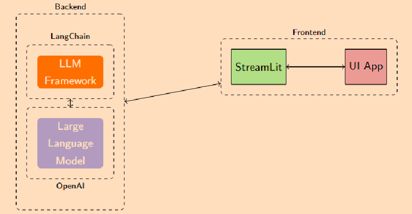

# Lesson Plan Generator
Lesson Plan Generator built for Georgia Institute of Technology CS6460: Educational Technology project.

#Synopsis:
The need for personalized instruction has become very important. The diversity in today’s classrooms presents educators with new challenges related to learning styles and the increased presence of students with disabilities. These challenges have highlighted the need for new and innovative ways to support students and educators where traditional lesson planning methods often have proved inadequate. The goal of this project is to develop a lesson plan generator that leverages user input through an intuitive interface to produce personalized lesson plans. By automating and simplifying the process of lesson plan creation, this tool will allow educators to individualize educational experiences more efficiently. 

#Architecture:
 

#Summary:
A streamlit application built using streamlit, langchain and Azure OpenAI
* Lesson pla generator - Generates personalized lesson plans based on user inputs. The generator uses student demographics, learning goals, preferred teaching method and customized options to generate the relevant lesson plans. After generation the user can download the lesson plan as a PDF.
* Lesson plan guidance - Provides user with a resource to generate additional information related to lesson planning.
* Generate resoure suggestions - Provides user with a generated list of web baased resources available for worksheets, videos and project ideas.

Usage:
The app requires you to have your own API key.

python 3.11.5
python -m venv venv
cd venv/scripts
activate

pip install -r requirements.txt

streamlit run 1_Workout_Plan_Generator.py

API key management: 

There are two ways to use the app. 

* 1 - Use the public version hosted on streamlit cloud. Provide your OPEN AI API key in the sidebar, validate the key, and then use the application. 

* 2 - Clone the repository, and provide the key in the secrets.toml file which should be placed in the .streamlit folder. 
